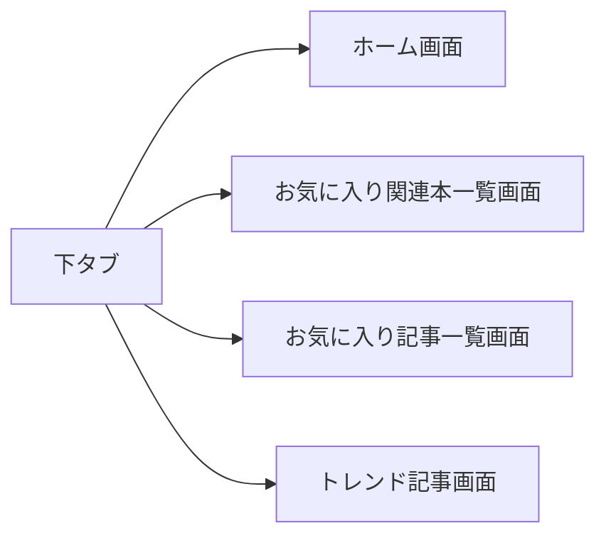
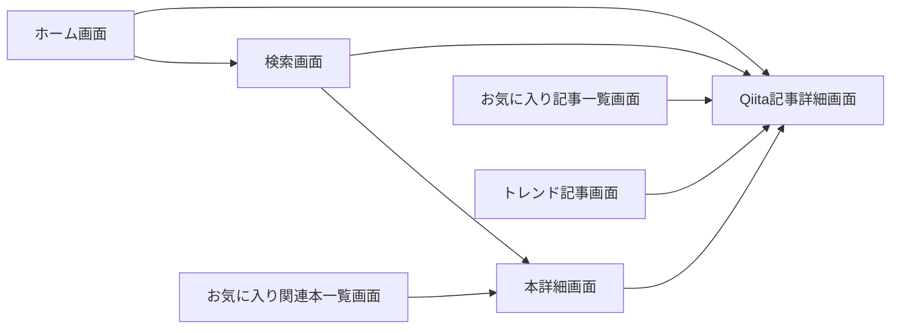

# techArticles-iOS

## iOS App Dev Tutorials
[iOS App Dev Tutorials](https://developer.apple.com/tutorials/app-dev-training)にswiftUIを用いたサンプルアプリのチュートリアルがあるので、それを元にしてSwiftUIを利用したアプリ開発の基本を学ぶ

チュートリアルで書いたコードはmainブランチではなく```feature/iOS_app_dev_tutorial```ブランチで管理する

## アプリ開発

[技術書ランキングをQiita記事の集計から作成したテック・ブック・ランク](https://www.techbookrank.com/)というページをオマージュしてQiita記事を表示するアプリを作ってみる。

上記のサイトはQiitaのAPIから投稿記事を取り出し技術書籍を紹介している箇所を集計してランキング作成している。

### 作成する画面
下記の画面が完成することを一旦ゴールにする（飽きたら途中でやめる）
- ホーム画面
- お気に入り関連本一覧画面
- お気に入り記事一覧画面
- トレンド記事画面
- 検索画面
- Qiita記事詳細画面
- 本詳細画面

### 画面遷移のイメージ
（試しにmdで図を描画したがわかりにくい。。）



